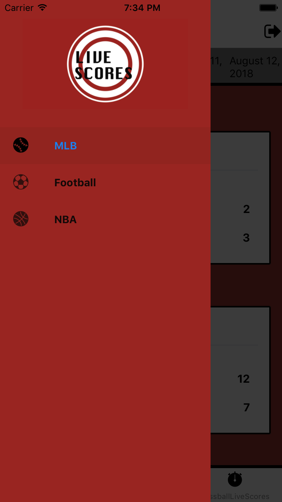
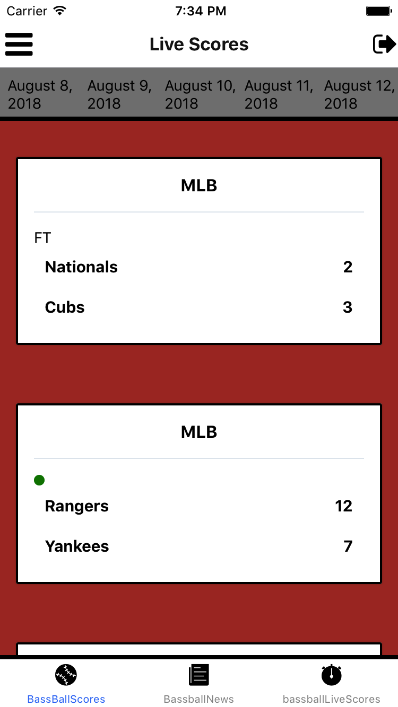
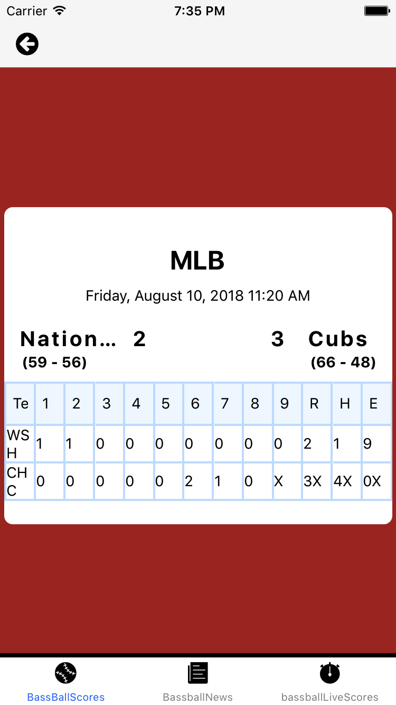
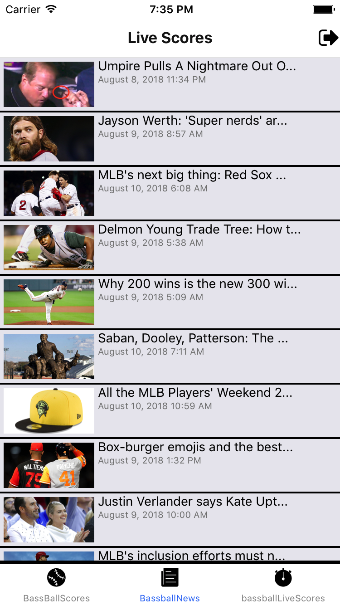

# Live_Scores

live scores app gives you live coverage for match(results, fixtures, news) for a MLB  and NBA and European football. liveScores project was built with React Native Expo and firebase backend to authentication users. we used <a href='https://developer.sportradar.com'/>sportradar</a> to fetch live match information like matches schedules & we also used <a href='https://newsapi.org/sources'>News Api</a> to fetch articles and new about the sports.

# Dependencies & Libraries
<ul>
<li>React Native</li>
<li>Expo</li>
<li>Nodejs</li>
<li>Firebase</li>
<li>Axios</li>
<li>moment</li>
<li>React Redux</li>
<li>Redux Thunk</li>
<li>React Native Elements</li>
<li>React Navigation</li>
<li>React Native Image cache</li>
</ul>

Please check the project on Expo and follow me
https://expo.io/@salman90/scores-live
